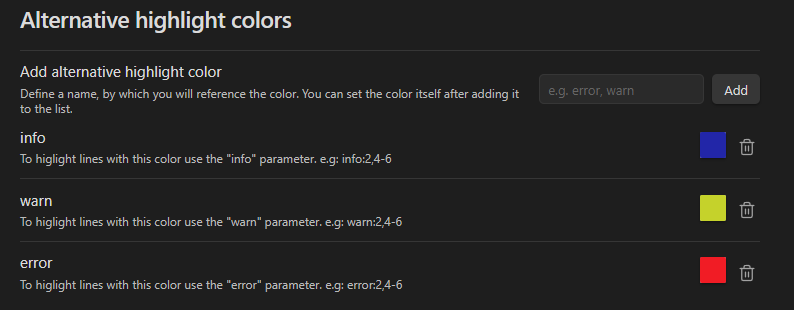
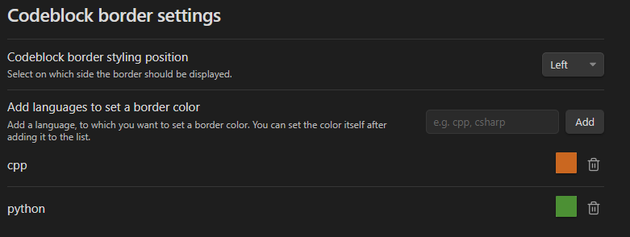
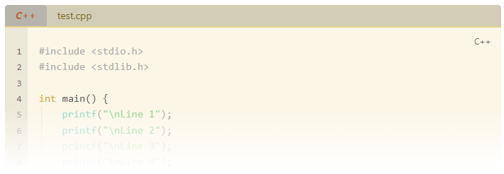
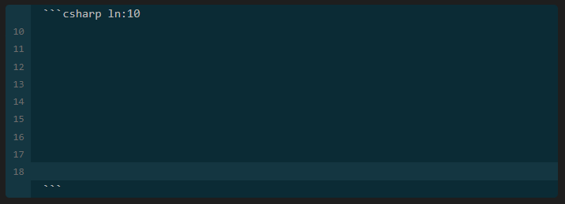

<h1 align="center">Codeblock Customizer Plugin</h1>

<p align=center>
<a href="https://github.com/mugiwara85/CodeblockCustomizer/releases/latest"></a>
<a></a>
</p>

> [!important]
> Version `1.2.2` changes
> 
> New options:
> - You can now exclude specific code blocks by defining the `exclude` parameter
> - You can now enable/disable the plugin in source mode
> - Added option to display indentation lines in reading view
> - Lines in reading view can now be collapsed
> - Added option to display a copy code button. This is very similar to the default Obsidian copy code button, with the difference that it will be always shown, even if you click inside a code block


This is a plugin for Obsidian (https://obsidian.md).

Since I didn't find any plugin, where I could customize code blocks, which works reliable, and works in editor and reading mode as well, I created my own. I am not a designer, so if you have created a cool theme, send me the color codes, and I might include it as a default theme in the next release :-)

This plugin works in editor mode and in reading mode!

The plugin lets you customize the code blocks in the following way:
- Default Obsidian and Solarized theme. You can create your own themes as well.
- Enable editor active line highlight. The active line in Obsidian (including code blocks) will be highlighted (you can customize the color).
- Enable code block active line highlight. The active line inside a code block will be highlighted (you can customize the color).
- Exclude languages. You can define languages separated by a comma, to which the plugin will not apply. You can also define `exclude` for specific code blocks to exclude them.
- Set background color for code blocks.
- Lets you highlight specific lines.
    - Customize highlight color
- Lets you define multiple highlight colors to highlight lines.
- Display filename
    - If a filename is defined a header will be inserted, where it is possible to customize the text (color, bold, italic), and the header (color, header line) itself as well
- Fold code
    - If the header is displayed (either by defining filename or other way explained below), you can click on the header to fold the code block below it 
- Display code block language. This displays the language (if specified) of the code block in the header. 
    - Customize text color, background color, bold text, italic text for the language tag inside the header.
    - By default the language tag is only displayed, if the header is displayed, and a if a language is defined for a code block. You can however force, to always display the code block language, even if the header would not be displayed.
- Display code block language icon (if available for the specified language) in the header.
- Add line numbers to code blocks
    - Customize if the line number should also be highlighted, if a line is highlighted
    - Customize background color, and color of the line numbers
- and much more...

## Themes

The plugin comes with a default Obsidian and a Solarized theme. The default theme is Obsidian.

Default Solarized theme (dark mode): 


Default Solarized theme (light mode): 


How the themes work:
- Every setting and color is saved in the theme, except the excluded languages.
- You can't modify or delete the default themes.
- When you switch themes, all unsaved changes are lost. Therefore it is recommended to create your own theme (unless you are happy with the default settings and will never change the theme), and always save your changes. If you made a change, and did not save it, the theme will not include it! 
- Each theme has its own light and dark colors. To customize the light/dark colors, just switch Obsidian to light/dark mode, and you can change the colors for that mode.
- When creating a new theme the currently selected theme will be taken as a template for the new theme.
- After saving changes in a theme, these become the new default values. Example: You select a color (red) and save the theme. Now, this color is the default value. This means, that if you click the "restore default color" icon next to the color picker the color red will be restored.

## Highlighting

### Main highlight

To highlight lines specify `hl:` followed by line numbers in the first line of the code block. 
- You can specify either single line numbers separated with a comma e.g.: `hl:1,3,5,7`.
- You can specify ranges e.g.: `hl:2-5` This would highlight lines from 2 to 5. 
- You can also combine the methods e.g.: `hl:1,3,4-6` This would highlight lines 1, 3 and lines from 4 to 6.

Example:
` ```cpp hl:1,3,4-6`


### Alternative highlight

With version `1.1.0` this new feature is released. From now on, you can define multiple highlight colors. This means, that you have to define a name for the highlight color. This name will be used as a parameter, and you can use it just like with the `hl` parameter. 

Example: 
You define three types of highlight colors (`info`, `warn`, `error`). After that set the colors. After that you can use it in the first line of code blocks:
` ```cpp info:2 warn:4-6 error:8`



Example code block with multiple highlight colors:

![[Pasted_image_20230314211417.png]](attachments/Pasted_image_20230314211417.png)

### Border colors

You can define colors for languages. This means, that if you want to show a border color on `cpp` code blocks then you have to add `cpp` to the list first. After adding it to the list you can set the color. You can also choose on which side (left/right) the border should be displayed. If you don't select a side, the colors will not be displayed.




## Display filename

To display a filename specify `file:` or `title:` followed by a filename in the first line of the code block. If the filename contains space, specify it between `""` e.g.: `file:"long filename.cpp"`. `title` is basically an alias for file. If both are defined, then `file` will be used

Example:
` ```cpp file:test.cpp`
` ```cpp title:test.py`
` ```cpp file:"long filename.cpp"`


## Folding

### Default fold

To specify an initial fold state when the document is opened, specify `fold` in the first line of the code block. If `fold` is defined in a code block, then when you open the document, the code block will be automatically collapsed, and only the header will be displayed. You can unfold the code block by clicking on the header.

Example:
` ```cpp fold`


### Semi-fold

You can enable semi-folding in settings tab: 

After enabling it, you have to select the count of the visible lines (default is 5). Optionally you can also enable an additional uncollapse button, which will be displayed in the last line.
Semi-fold works just like the normal fold with the following differences:
- If your code block doesn't have minimum required lines, then it will fold as until now.
- If your code block does have the minimum required line (count of visible lines + 4 for fading effect), then it will semi-fold.

The number of the "fade" lines is constant, and cannot be changed. 
Example: You set the count of visible lines to 5, and you have a code block with 10 lines. In this case semi-fold will be used. The first 5 lines remain visible, and the next 4 lines will "fade away". 

>[!note]
>There is a slight difference between editing mode and reading mode. In editing mode the first line of the code block (where you define the language and the parameters) also counts, in reading mode not, since it doesn't exist. This will probably change in the next release so it is the same between editing and reading mode.

Example semi-folded code block (light theme):


Example semi-folded code block (dark theme):


Example semi-folded code block with additional uncollapse button:


## Icon

Version `1.1.0` introduces a new feature. It is possible from now on, to display an icon for the code blocks. There are currently around 170 icons available for different languages. You can enable the option in the settings page to display icons in the header. If you enable this option, and if the language specified in the code block has an icon, and the header is displayed, then the icon will be displayed. You can also force to always display the icon (which also means that the header will be also displayed) even if the header is not displayed, because the `file` parameter is not defined.

## Header

The header is displayed in the following cases:
- You specified a `file:` or `title:`
- You specified `fold`. If you specified `fold` but did not specify `file:` or `title:` a default text `Collapsed code` will be displayed on the header
- You enabled the `Always display codeblock language` or the `Always display codeblock language icon` option in settings, but did not specify `file:` or `title:` or `fold`

If the header is displayed, folding works as well. If `Always display codeblock language` is enabled then the header will display the code block language as well.

Example:
- Header with fold only


- Header with code block language only


- Header with code block language and filename as well


- Header with code block language, filename and icon as well

![[Pasted_image_20230314212111.png]](attachments/Pasted_image_20230314212111.png)

## Line numbers

To enable line numbers go to the plugin settings and enable the `Enable line numbers` option. After that the line numbers will be displayed before code blocks. 
**Note:** The method how line numbers were displayed before version `1.1.0` does not exist anymore. Line numbers are displayed from now on, as shown below.

Example:

![[Pasted_image_20230314211657.png]](attachments/Pasted_image_20230314211657.png)

Example for reading mode:


### ln parameter

The `ln:` parameter can have 3 values: `true`, `false`, `number`
- If `ln` is set to `ln:true`, then for that specific code block only, the line numbers will be displayed, even if line numbers are not enabled in the settings.
- If `ln` is set to `ln:false`, then for that specific code block only, the line numbers will NOT be displayed, even if line number are enabled in the settings.
- If `ln` is set to a number, e.g. `ln:5`, then it sets the offset for the line numbers.



## Commands

There are three commands available in the command palette. You can:
- fold all code blocks in the current document,
- unfold all code blocks in the current document,
- restore original state of code blocks

If you collapsed/uncollapsed all code blocks there is no need to restore them to their original state. When you switch documents they are automatically restored to their original state.


## Inline code

If you want to style inline code, you have to enable it first. After that you can set the background color and the text color for inline code.


## Print to PDF

By default, if you print a document the styling is not applied to it. You can enable it in the settings. By default, the light colors are used for printing, but if you want to force the dark colors, you can enable the second toggle.


## How to install the plugin

- Simply install directly from Obsidian
- or you can just copy over `main.js`, `styles.css`, `manifest.json` to your vault `VaultFolder/.obsidian/plugins/codeblock-customizer/`.

## Support

If you like this plugin, and would like to help support continued development, use the button below!
 
<a href="https://www.buymeacoffee.com/ThePirateKing"></a>
